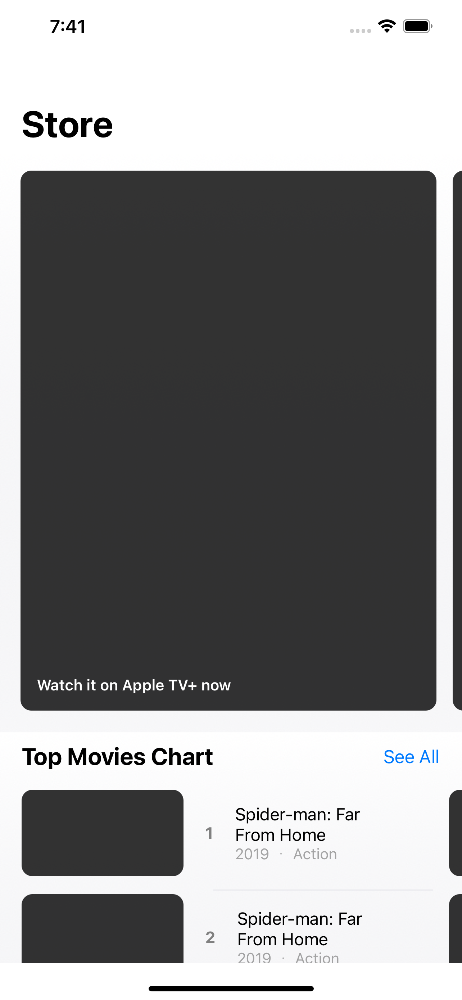
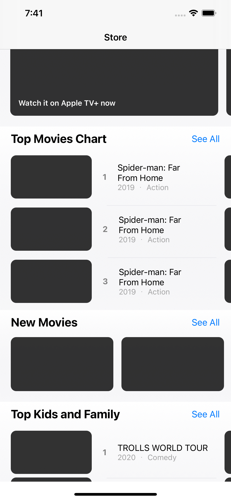
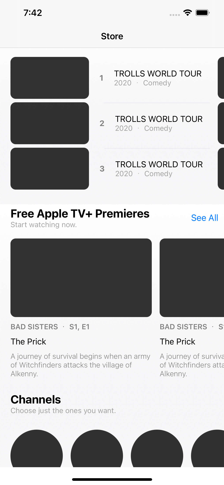
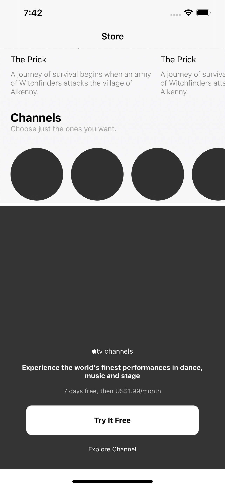

# AppleTV-Clone
An implementation of complex layout of Apple TV using UICompositional layout in swift

### Note ⚙️
The application was built using: 
* Xcode 12.5.1
* Swift 5.4
* macOS Big Sur 11.5.2

### Core Technologies 📲
* Swift
* Programmatic UI

# Screenshots 📸

